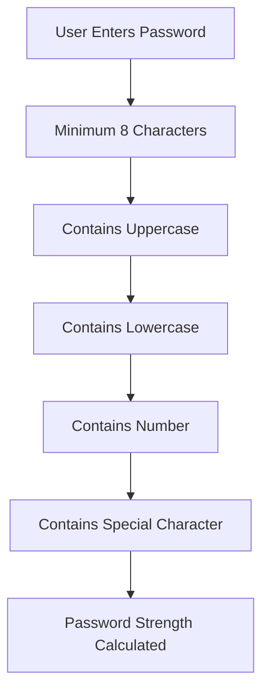
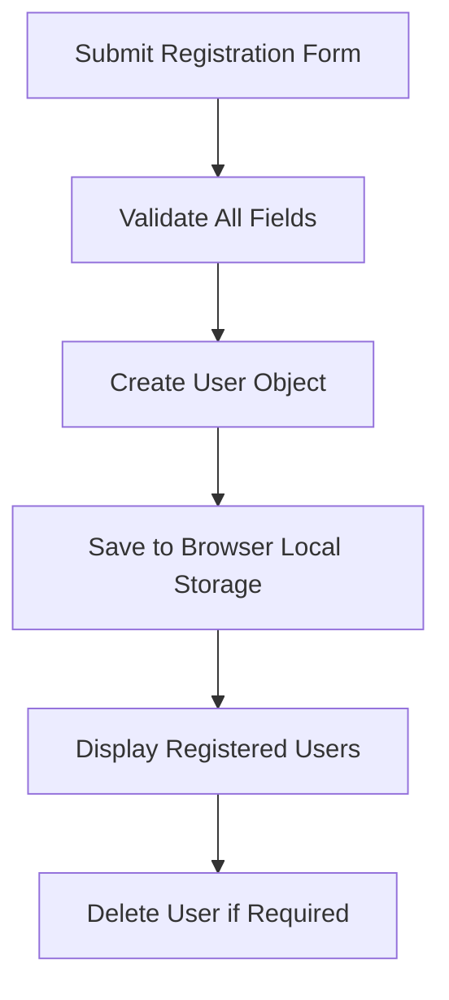
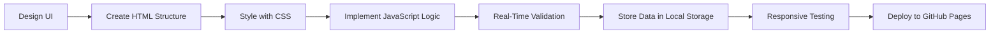

<div align="center">

# 🛡️ FormGuard

### Professional Client-Side Form Validation System

<p align="center">
A modern, responsive, and feature-rich registration form built using HTML5, CSS3, and Vanilla JavaScript. FormGuard demonstrates real-time validation, password strength analysis, Local Storage integration, responsive design, and modern frontend development best practices.
</p>

<p align="center">


</p>

<p align="center">

### 🌐 Live Demo

🔗 https://rachit1807.github.io/FormGuard/

### 📂 GitHub Repository

🔗 https://github.com/rachit1807/FormGuard

</p>

</div>

---

# 📑 Table of Contents

- 📖 Project Overview
- ✨ Features
- 💻 Technology Stack
- 📂 Project Structure
- 🚀 Getting Started
- 🔒 Validation Rules
- 📊 Password Validation Workflow
- 💾 Local Storage Workflow
- 📱 Responsive Design
- 📊 Project Statistics
- ⭐ Why FormGuard?
- 🚀 Future Improvements
- 👨‍💻 Author
- 📄 License

---

# 📖 Project Overview

FormGuard is a professional client-side registration form developed using **HTML5**, **CSS3**, and **Vanilla JavaScript**.

The project demonstrates how modern frontend applications perform validation before data reaches a backend server. Every field is validated in real time to improve user experience while reducing invalid form submissions.

The application includes dynamic password strength analysis, live validation feedback, responsive layouts, browser Local Storage integration, user management, loading animations, and success screens without relying on external frameworks or libraries.

It is designed as a portfolio-quality frontend project that showcases clean UI, modular JavaScript, reusable code, and production-ready development practices.

---

# ✨ Features

| Feature | Status |
|----------|:------:|
| Real-Time Form Validation | ✅ |
| Regex-Based Validation | ✅ |
| Password Strength Meter | ✅ |
| Live Password Checklist | ✅ |
| Password Show / Hide Toggle | ✅ |
| Confirm Password Matching | ✅ |
| Email Validation | ✅ |
| Phone Number Validation | ✅ |
| Country Selection Validation | ✅ |
| Loading Animation | ✅ |
| Success Confirmation Screen | ✅ |
| Countdown Redirect | ✅ |
| Register Another User | ✅ |
| Browser Local Storage | ✅ |
| Registered Users Table | ✅ |
| Delete Registered Users | ✅ |
| Responsive Design | ✅ |
| Mobile Friendly | ✅ |
| Pure Vanilla JavaScript | ✅ |

---
# 💻 Technology Stack

| Technology | Purpose |
|------------|---------|
| **HTML5** | Semantic page structure |
| **CSS3** | Modern styling, layout, responsiveness, animations |
| **JavaScript (ES6)** | Form validation, DOM manipulation, dynamic UI |
| **Regular Expressions** | Email, phone, password validation |
| **Local Storage API** | Persistent client-side user storage |

---

# 📂 Project Structure

```text
FormGuard/
│
├── index.html
│
├── styles/
│   └── form.css
│
├── scripts/
│   └── script.js
│
└── README.md
```

---

# 🚀 Getting Started

## Clone the Repository

```bash
git clone https://github.com/rachit1807/FormGuard.git
```

## Navigate into the Project

```bash
cd FormGuard
```

## Open the Application

Simply open **index.html** in your preferred browser.

or

Use **Live Server** in VS Code for the best development experience.

---

# 🔒 Validation Rules

| Field | Validation Rule |
|-------|-----------------|
| Name | Minimum 3 characters |
| Email | Must follow valid email format |
| Phone | Exactly 10 digits |
| Country | Selection required |
| Password | Minimum 8 characters |
| Uppercase Letter | Required |
| Lowercase Letter | Required |
| Number | Required |
| Special Character | Required |
| Confirm Password | Must match Password |

---

# 📊 Password Validation Workflow



---

# 💾 Local Storage Workflow



---
# 📱 Responsive Design

FormGuard is designed using a **mobile-first responsive layout** to provide a consistent experience across different screen sizes.

| Device | Supported |
|---------|:---------:|
| Mobile Phones | ✅ |
| Tablets | ✅ |
| Laptops | ✅ |
| Desktop PCs | ✅ |

### Responsive Features

- Fluid Layout
- Flexible Form Width
- Responsive Typography
- Mobile-Friendly Buttons
- Optimized Tables
- Consistent Spacing
- Adaptive User Interface

---

# 📊 Project Statistics

| Metric | Value |
|--------|-------|
| Project Type | Frontend Web Application |
| Language | Vanilla JavaScript |
| Framework | None |
| External Libraries | None |
| Storage | Browser Local Storage |
| Responsive Design | ✅ |
| Mobile Support | ✅ |
| Browser Compatibility | Chrome, Edge, Firefox, Safari |
| Password Strength Meter | ✅ |
| Real-Time Validation | ✅ |
| Data Persistence | Local Storage |

---

# 🌐 Browser Compatibility

| Browser | Supported |
|----------|:---------:|
| Google Chrome | ✅ |
| Microsoft Edge | ✅ |
| Mozilla Firefox | ✅ |
| Safari | ✅ |
| Opera | ✅ |

---

# 🚀 Key Learning Outcomes

During this project, the following frontend concepts were implemented and practiced:

- HTML5 Semantic Structure
- Modern CSS3 Layout Techniques
- Responsive Web Design
- JavaScript DOM Manipulation
- Event Handling
- Form Validation
- Regular Expressions (Regex)
- Password Strength Evaluation
- Browser Local Storage API
- Dynamic UI Rendering
- CRUD Operations on Local Storage
- Loading Animations
- User Experience (UX) Improvements
- Clean Code Organization
- Modular Frontend Development

---

# 📈 Project Highlights

| Capability | Status |
|------------|:------:|
| Professional UI | ⭐⭐⭐⭐⭐ |
| Code Readability | ⭐⭐⭐⭐⭐ |
| User Experience | ⭐⭐⭐⭐⭐ |
| Validation Logic | ⭐⭐⭐⭐⭐ |
| Responsive Design | ⭐⭐⭐⭐⭐ |
| Performance | ⭐⭐⭐⭐⭐ |
| Portfolio Ready | ✅ |
| Recruiter Friendly | ✅ |
| Open Source | ✅ |

---

# 🎯 Use Cases

FormGuard can serve as a foundation for:

- User Registration Systems
- College Mini Projects
- Frontend Development Portfolio
- Authentication UI Prototype
- Login & Signup Interfaces
- Internship Assignments
- JavaScript Practice Projects
- Frontend Interview Demonstrations

---
# ⭐ Why FormGuard?

FormGuard was built to demonstrate how modern client-side form validation can improve user experience while maintaining clean, maintainable, and scalable frontend code.

### Highlights

- ✅ Real-Time Validation
- ✅ Instant User Feedback
- ✅ Password Strength Analysis
- ✅ Live Password Requirement Checklist
- ✅ Secure Password Visibility Toggle
- ✅ Browser Local Storage Integration
- ✅ Registered Users Management
- ✅ Responsive Design
- ✅ Modern UI/UX
- ✅ Clean Code Structure
- ✅ No External Frameworks
- ✅ Portfolio Ready
- ✅ Recruiter Friendly

---

# 🚀 Future Improvements

The following enhancements can be implemented in future versions:

- Backend Integration (Node.js / Express)
- MongoDB Database Support
- User Authentication
- Login & Logout System
- Email Verification
- Forgot Password Functionality
- Dark / Light Theme Toggle
- Search Registered Users
- Edit Registered User Details
- Export User Data (CSV / PDF)
- Pagination for Large User Lists
- Unit Testing
- Accessibility Improvements
- Progressive Web App (PWA)
- Docker Deployment

---

# 📈 Development Workflow



---

# 🤝 Contributing

Contributions are always welcome.

If you'd like to improve FormGuard:

1. Fork the repository
2. Create a new feature branch
3. Commit your changes
4. Push your branch
5. Open a Pull Request

---

# 👨‍💻 Author

**Rachit Tripathi**

- 🌐 GitHub: https://github.com/rachit1807
- 💼 LinkedIn: https://www.linkedin.com/in/rachittripathi2509/

---

# 📄 License

This project is licensed under the **MIT License**.

You are free to use, modify, and distribute this project with proper attribution.

---

<div align="center">

## ⭐ If you found this project useful, consider giving it a Star on GitHub!

### 🌐 Live Demo
https://rachit1807.github.io/FormGuard/

### 📂 Repository
https://github.com/rachit1807/FormGuard

**Built with ❤️ using HTML5, CSS3 & Vanilla JavaScript**

</div>