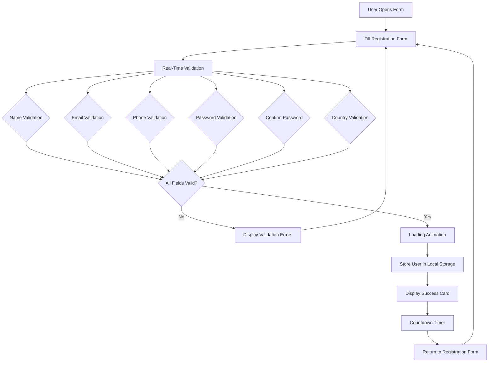
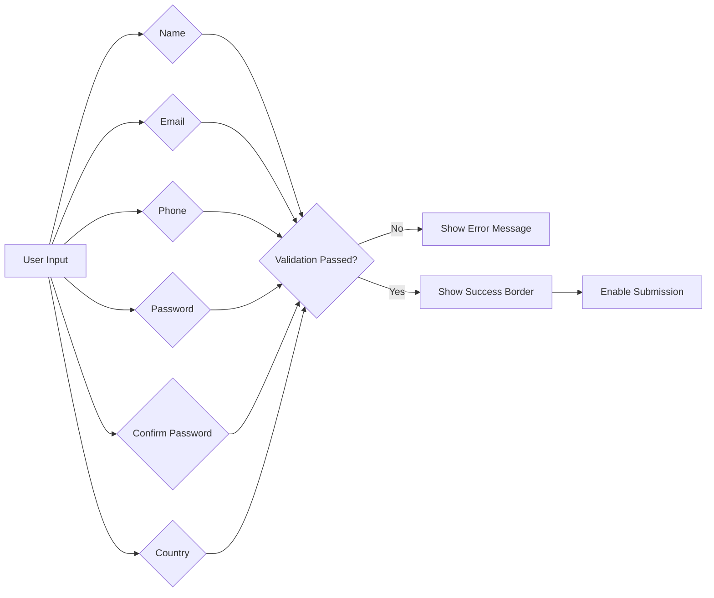

<div align="center">

# 🛡️ FormGuard
### Professional Client-Side Form Validation System

<p align="center">
A modern, responsive, and feature-rich client-side registration form built using HTML5, CSS3, and Vanilla JavaScript with real-time validation, password strength analysis, Local Storage, responsive UI, and professional user experience.
</p>

<p align="center">


</p>

</div>

---

# 📑 Table of Contents

- Project Overview
- Live Demo
- Features
- Technology Stack
- Project Statistics
- Why FormGuard?

---

# 📖 Project Overview

FormGuard is a professional client-side form validation system developed using **HTML5**, **CSS3**, and **Vanilla JavaScript**.

The project demonstrates modern frontend development practices including:

- Real-time form validation
- Password strength analysis
- Live password requirement checklist
- Secure password visibility toggle
- Responsive user interface
- Loading animation
- Success confirmation screen
- Local Storage integration
- Registered users management
- Mobile-friendly design

The project focuses on creating a clean user experience while following modern JavaScript development practices without relying on external frameworks or libraries.

---

# 🌐 Live Demo

> 🚀 GitHub Pages Link

```
Coming Soon
```

---

# 📂 Repository

```
Coming Soon
```

---

# ✨ Features

| Feature | Status |
|----------|--------|
| Real-Time Validation | ✅ |
| Regex Based Validation | ✅ |
| Password Strength Meter | ✅ |
| Password Checklist | ✅ |
| Show / Hide Password | ✅ |
| Confirm Password Validation | ✅ |
| Email Validation | ✅ |
| Phone Validation | ✅ |
| Country Selection Validation | ✅ |
| Loading Animation | ✅ |
| Success Card | ✅ |
| Auto Return Countdown | ✅ |
| Register Another User | ✅ |
| Local Storage Support | ✅ |
| Registered Users Table | ✅ |
| Delete Registered User | ✅ |
| Responsive Design | ✅ |
| Mobile Friendly | ✅ |

---

# 💻 Technology Stack

| Technology | Purpose |
|------------|----------|
| HTML5 | Page Structure |
| CSS3 | Styling & Responsive Layout |
| JavaScript (ES6) | Validation Logic |
| Local Storage API | Persistent Data Storage |
| Regular Expressions | Input Validation |

---

# 📊 Project Statistics

| Metric | Value |
|---------|-------|
| Language | Vanilla JavaScript |
| Framework | None |
| External Libraries | None |
| Storage | Browser Local Storage |
| Responsive Design | ✅ |
| Mobile Support | ✅ |
| Browser Compatibility | Modern Browsers |

---

# ⭐ Why FormGuard?

✔ Professional UI Design

✔ Real-Time Validation

✔ Responsive Layout

✔ Password Strength Analysis

✔ Modern JavaScript Practices

✔ Browser Local Storage Integration

✔ Clean Code Architecture

✔ Recruiter-Friendly Project

✔ Easy to Extend

✔ Production-Ready Frontend
# ⚙️ Installation

Follow these steps to run the project locally.

### 1️⃣ Clone the Repository

```bash
git clone https://github.com/rachit1807/FormGuard.git
```

---

### 2️⃣ Navigate to the Project

```bash
cd FormGuard
```

---

### 3️⃣ Open the Project

Open the project using **Visual Studio Code**.

---

### 4️⃣ Run the Project

Open **index.html** in your browser

OR

Use the **Live Server** extension in VS Code.

---

# 📂 Project Structure

```
FormGuard/
│
├── index.html
│
├── styles/
│   └── form.css
│
├── scripts/
│   └── validation.js
│
├── assets/
│   ├── screenshots/
│   └── icons/
│
├── LICENSE
│
└── README.md
```

---

# 🏗️ Project Architecture



---

# 🔄 Form Validation Flow



---

# 🔐 Password Validation Workflow

```mermaid
flowchart TD

Password

↓

Minimum 8 Characters

↓

Uppercase Present?

↓

Lowercase Present?

↓

Number Present?

↓

Special Character Present?

↓

Password Strength Meter Updates

↓

Weak / Medium / Strong
```

---

# 💾 Local Storage Workflow

```mermaid
flowchart TD

Submit Form

↓

Validate Data

↓

Save User Object

↓

Local Storage

↓

Render Registered Users

↓

Delete User

↓

Update Local Storage

↓

Re-render Table
```

---

# 🧠 Validation Rules

| Field | Validation |
|--------|------------|
| Full Name | Minimum 3 alphabetic characters |
| Email | Valid email format |
| Phone | Valid 10-digit Indian phone number |
| Password | Minimum 8 characters |
| Uppercase | Required |
| Lowercase | Required |
| Number | Required |
| Special Character | Required |
| Confirm Password | Must match password |
| Country | Required |

---

# 🔒 Password Security Features

- ✔ Live Password Strength Meter
- ✔ Password Requirement Checklist
- ✔ Password Visibility Toggle
- ✔ Confirm Password Matching
- ✔ Secure Regular Expression Validation

---

# 💾 Local Storage

The application stores registered users directly inside the browser using the Local Storage API.

Stored Information:

- Full Name
- Email Address
- Phone Number
- Country

Users remain available after refreshing the page until browser storage is cleared.

---

# 📱 Responsive Design

The interface is fully responsive and optimized for:

| Device | Supported |
|----------|-----------|
| Desktop | ✅ |
| Laptop | ✅ |
| Tablet | ✅ |
| Mobile | ✅ |

The registered users table supports horizontal scrolling on smaller screens to preserve readability.

---
# 🚀 Usage Guide

### Step 1 — Open the Application

Launch the project in your preferred web browser.

---

### Step 2 — Fill the Registration Form

Provide the following details:

- Full Name
- Email Address
- Phone Number
- Password
- Confirm Password
- Country

---

### Step 3 — Real-Time Validation

As you type, FormGuard validates every field instantly.

✔ Valid inputs receive a green border.

❌ Invalid inputs display a descriptive error message.

---

### Step 4 — Password Analysis

The password field provides:

- Live Password Strength Meter
- Password Requirement Checklist
- Password Visibility Toggle

---

### Step 5 — Submit

Once all validations pass:

- Loading animation appears
- User information is saved to Local Storage
- Success card is displayed
- Automatic countdown starts
- Registration form reappears automatically

---

### Step 6 — Manage Users

Users can:

- View registered users
- Delete individual users
- Refresh the page without losing data (Local Storage)

---

# 🎯 Core Functionalities

| Module | Description |
|---------|-------------|
| Form Validation | Validates every field in real time |
| Regex Validation | Email, phone and password verification |
| Password Meter | Displays Weak / Medium / Strong password |
| Password Checklist | Shows live password requirements |
| Show / Hide Password | Toggle password visibility |
| Loading Screen | Simulates professional form submission |
| Success Card | Displays submitted user details |
| Countdown | Automatically returns to the form |
| Local Storage | Persists user data in the browser |
| Users Table | Displays all registered users |
| Delete User | Removes a user from Local Storage |

---

# 🌐 Browser Compatibility

| Browser | Supported |
|----------|-----------|
| Google Chrome | ✅ |
| Microsoft Edge | ✅ |
| Mozilla Firefox | ✅ |
| Safari | ✅ |
| Opera | ✅ |

---

# 📈 Skills Demonstrated

## Frontend Development

- Semantic HTML5
- Responsive CSS3
- Flexbox Layout
- Media Queries

---

## JavaScript

- DOM Manipulation
- Event Handling
- Functions
- Arrays
- Objects
- Local Storage API
- Regular Expressions
- Form Validation
- Dynamic Rendering

---

## User Experience

- Real-Time Feedback
- Password Strength Indicator
- Interactive UI
- Success Notifications
- Mobile Responsive Design

---

# 📊 Project Highlights

| Category | Details |
|----------|---------|
| Programming Language | JavaScript (ES6) |
| Framework | None |
| CSS Framework | None |
| Data Storage | Browser Local Storage |
| Responsive | Yes |
| Mobile Friendly | Yes |
| Accessibility | Basic Form Accessibility |
| Code Style | Modular & Readable |

---

# 🔮 Future Enhancements

Potential improvements for future versions:

- User Login & Authentication
- Edit Registered Users
- Search Users
- Pagination
- Export Users to CSV
- Dark Mode
- Profile Pictures
- Email Verification
- Password Generator
- OTP Verification
- Backend Integration (Node.js + Express)
- Database Integration (MongoDB / MySQL)
- JWT Authentication
- REST API
- Admin Dashboard

---

# 📚 Learning Outcomes

This project demonstrates practical understanding of:

- Client-Side Form Validation
- DOM Manipulation
- JavaScript Event Listeners
- Browser Storage APIs
- Password Security Principles
- Responsive Web Design
- Clean UI Design
- Modular Programming
- Error Handling
- User Experience Design

---

# 🧪 Testing Checklist

| Feature | Status |
|----------|--------|
| Name Validation | ✅ |
| Email Validation | ✅ |
| Phone Validation | ✅ |
| Password Validation | ✅ |
| Confirm Password | ✅ |
| Country Selection | ✅ |
| Password Meter | ✅ |
| Password Checklist | ✅ |
| Show / Hide Password | ✅ |
| Success Card | ✅ |
| Countdown Timer | ✅ |
| Local Storage | ✅ |
| Registered Users Table | ✅ |
| Delete User | ✅ |
| Responsive Design | ✅ |

---

# 📌 Best Practices Followed

- Semantic HTML Structure
- Organized CSS
- Modular JavaScript
- Meaningful Variable Names
- Reusable Functions
- Separation of Concerns
- Responsive Design Principles
- Client-Side Data Persistence
- User-Friendly Validation Messages
- Consistent Code Formatting

---
# 🤝 Contributing

Contributions are welcome and greatly appreciated.

If you'd like to improve this project:

1. Fork the repository
2. Create a new feature branch

```bash
git checkout -b feature/YourFeatureName
```

3. Commit your changes

```bash
git commit -m "Add: Your Feature"
```

4. Push the branch

```bash
git push origin feature/YourFeatureName
```

5. Open a Pull Request

---

# 📋 Coding Standards

This project follows the following development principles:

- Clean and readable code
- Consistent naming conventions
- Modular JavaScript functions
- Responsive CSS design
- Semantic HTML structure
- Descriptive comments
- User-friendly validation messages

---

# 📖 Version History

| Version | Description |
|----------|-------------|
| v1.0.0 | Initial release |
| v1.1.0 | Added Real-Time Validation |
| v1.2.0 | Added Password Strength Meter |
| v1.3.0 | Added Password Requirement Checklist |
| v1.4.0 | Added Show/Hide Password |
| v1.5.0 | Added Loading Animation |
| v1.6.0 | Added Success Card |
| v1.7.0 | Added Auto Return Countdown |
| v1.8.0 | Added Local Storage |
| v1.9.0 | Added Registered Users Table |
| v2.0.0 | Responsive UI & Project Optimization |

---

# 🛡️ Security Notes

This project is intended for educational purposes and demonstrates **client-side validation**.

**Important:**

Client-side validation alone is **not sufficient** for production applications.

In a real-world deployment, validation should also be performed on the server side to ensure data integrity and security.

---

# 🎯 Project Goals

This project was developed to demonstrate:

- Modern JavaScript Programming
- Client-Side Form Validation
- Regular Expression Validation
- Responsive Web Design
- Browser Storage APIs
- DOM Manipulation
- Interactive User Experience
- Clean Project Architecture

---

# 🏆 Achievements

✔ Fully Responsive Design

✔ Real-Time Form Validation

✔ Regex-Based Validation

✔ Interactive Password Strength Meter

✔ Live Password Requirement Checklist

✔ Password Visibility Toggle

✔ Local Storage Integration

✔ Registered Users Management

✔ Auto Return Countdown

✔ Modern User Interface

✔ Modular JavaScript Code

✔ Beginner-Friendly Project Structure

---

# 📜 License

This project is licensed under the **MIT License**.

Feel free to use, modify, and distribute this project in accordance with the license terms.

---

# 👨‍💻 Author

<div align="center">

## Rachit Tripathi

**B.Tech Information Technology Student**

Passionate about Full Stack Development, JavaScript, AI, and Building Modern Web Applications.

---

### Connect with Me

**GitHub**

https://github.com/rachit1807

**LinkedIn**

https://linkedin.com/in/rachittripathi2509

</div>

---

# 🙏 Acknowledgements

Special thanks to:

- CodeMore Technologies for providing the internship opportunity.
- The open-source community for continuous inspiration.
- Every developer who believes in writing clean, maintainable, and user-friendly code.

---

# ⭐ Support

If you found this project helpful:

- ⭐ Star this repository
- 🍴 Fork the repository
- 🐛 Report bugs
- 💡 Suggest improvements

Your support is greatly appreciated.

---

<div align="center">

## 🚀 FormGuard

### Professional Client-Side Form Validation System

Built with ❤️ using **HTML5**, **CSS3**, and **Vanilla JavaScript**

© 2026 Rachit Tripathi. All Rights Reserved.

</div>